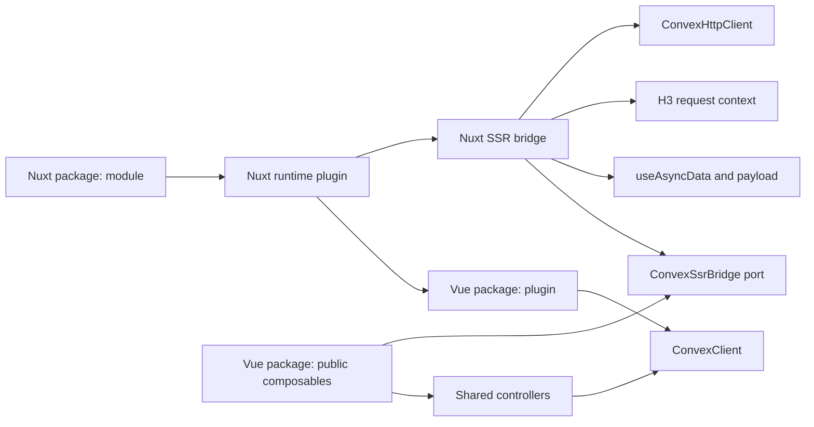

# Convex for Vue and Nuxt: design proposal

Status: proposed

Date: 2026-09-02

Audience: maintainers of new Vue and Nuxt integrations for Convex

## Decision in one page

Build a versioned monorepo with two public packages on top of Convex's framework-neutral `ConvexClient` and `ConvexHttpClient`:

- `@j-boardman/convex-vue` owns the Vue 3 plugin, app-scoped browser runtime, typed composables, auth, query and pagination controllers, and manual SSR seed contract.
- `@j-boardman/convex-nuxt` depends on that exact Vue package version and adds the Nuxt module, auto-imports, runtime configuration, H3 request isolation, and Nuxt payload-to-live SSR bridge.

The package names are accepted. Do not wrap, fork, or use an existing community package as the implementation baseline. The two-package split follows independently from state ownership: Nuxt should adapt a real Vue integration rather than implement a second client. Community packages are useful only as prior art, migration input, and evidence of failure modes.

The integration should have these properties from its first stable release:

- One WebSocket client owned by each browser Vue application, including each browser `NuxtApp`; no WebSocket client is created during SSR.
- One HTTP client per server operation, with authentication read from request-scoped Nuxt/H3 state. Tokens never enter public runtime config or the hydration payload.
- `useConvexQuery` renders data during SSR, reuses the Nuxt payload during hydration, then upgrades to a live subscription without clearing the server-rendered value.
- `useConvexPaginatedQuery` does the same for the first page, including a queued `loadMore` during hydration and automatic recovery from invalid cursors.
- Reactive auth drives `client.setAuth()` and exposes the state confirmed by Convex. React's token-refresh signal is a later parity item because the framework-neutral `ConvexClient` does not currently expose it.
- Queries expose an explicit state machine instead of using `undefined` to mean loading, skipped, or absent.
- Mutations and actions are thin, fully typed functions. Optimistic updates use Convex's own local store and rollback behavior.
- The Vue package owns the shared reactive behavior. The Nuxt package owns only Nuxt lifecycle, server request state, and payload transport.

The key design choice is an internal `ConvexSsrBridge` port in the Vue runtime. Its default implementation supports client-only operation and explicit `initialData`; the Nuxt plugin installs an implementation backed by Nuxt's payload lifecycle. A boxed, Convex-encoded value crosses the Nuxt SSR boundary, then the shared Vue query controller upgrades it to a live subscription after plugins, including auth, have run. This achieves the same result as Svelte's `convexLoad`—server data followed by a live client subscription—without putting Nuxt dependencies in the Vue package.

## Definition of done

The first stable release is done when packaged fixture applications can:

1. server-render an anonymous and an authenticated query without a loading or unauthenticated flash;
2. hydrate without issuing the same HTTP query again;
3. receive a later Convex update over the browser WebSocket;
4. execute typed mutations, actions, optimistic updates, skipped queries, and paginated `loadMore` calls;
5. isolate two simultaneous SSR requests with different auth tokens;
6. navigate client-side without routing Convex reads through the Nuxt server;
7. remount or hot-reload without closing or duplicating the app-scoped client;
8. run the same client-side query, write, auth, pagination, optimistic-update, and teardown contracts in a plain Vue 3 + Vite application; and
9. publish both packages from tarballs that pass type, Vue/Vite build, Nuxt build, browser, export-map, and package-consumer checks.

Unit tests alone do not satisfy this definition. The browser tests must inspect rendered HTML before hydration, the hydrated UI after hydration, network behavior, and live updates.

## What the source integrations tell us

This proposal is based on source and documentation snapshots taken on 2026-08-31.

| Evidence | Observed contract | Consequence for this design |
| --- | --- | --- |
| [Convex Svelte overview](https://docs.convex.dev/client/svelte/overview) and [reactivity](https://docs.convex.dev/client/svelte/reactivity) | An app-scoped `ConvexClient` provides live queries, mutations, actions, optimistic updates, skip, stale data, and pagination. | Use the same framework-neutral browser client and match these user-visible semantics. |
| [SvelteKit SSR](https://docs.convex.dev/client/svelte/sveltekit-server-rendering) | Server-fetched query metadata is transported to the browser and upgraded to a live subscription. Authenticated SSR uses request-scoped tokens. | Preserve the behavior, but implement the transport with Nuxt payload data and H3 request context. |
| [Svelte authentication](https://docs.convex.dev/client/svelte/authentication) | Provider state is not enough: Convex confirms authentication, and SSR state must survive until the client auth flow settles. | Model provider state and Convex-confirmed state separately. Configure auth before starting query subscriptions. |
| [`convex-svelte` 0.14 source and changelog](https://github.com/get-convex/convex-svelte/tree/18eb203b08c83bf47fecf363b4e6a278c44edb24) | Recent fixes address auth-before-subscribe ordering, HMR/remount ownership, stale pagination, queued `loadMore`, invalid cursors, and single-deployment enforcement. | Treat each as an invariant with a regression test. They are not Svelte-only details. |
| [Convex React overview](https://docs.convex.dev/client/react/overview), [React API](https://docs.convex.dev/api/modules/react), and [`convex` 1.45 React source](https://github.com/get-convex/convex-js/tree/4e30a02e649359e27c6699118923656cb74e42bb/src/react) | React also exposes dynamic query sets, connection state, rich query status, auth refresh state, preloaded queries, and paginated optimistic helpers. | Match the parts that map cleanly to Vue/Nuxt after Svelte parity is stable. |
| [Nuxt `useAsyncData`](https://nuxt.com/docs/4.x/api/composables/use-async-data) and [data fetching](https://nuxt.com/docs/4.x/getting-started/data-fetching) | Nuxt transfers keyed server data in its payload and reuses it during hydration. Client navigation can run the same composable without an extra hydration fetch. | Use `useAsyncData` as the SSR carrier and keep its handler side-effect free on the server. |
| [Nuxt plugins](https://nuxt.com/docs/4.x/directory-structure/app/plugins) and [`useRequestEvent`](https://nuxt.com/docs/4.x/api/composables/use-request-event) | Plugins run before components and can declare dependencies; the incoming H3 event is available only on the server. | Create the client in an early module plugin, configure auth in a dependent plugin, and keep tokens on the request event. |
| Existing [`convex-nuxt`](https://github.com/chris-visser/convex-nuxt) and [`convex-vue`](https://github.com/chris-visser/convex-vue) | The Nuxt package is a small auto-import/plugin wrapper over `convex-vue`; its package declares no tests. The Vue layer has no actions, auth state, pagination, connection state, or Nuxt payload-to-live contract. | Starting from these packages would leave the difficult work unsolved. Use them only as naming and migration references. |
| [`onmax/nuxt-convex`](https://github.com/onmax/nuxt-convex/tree/bb1d4086891fea1a723ab230bb0119185e9d22a6), commit `bb1d408` | The monorepo correctly separates `vue-convex` from a Nuxt module and has meaningful Vue tests. However, the inspected Nuxt plugin mainly installs the Vue plugin; the Vue transport reaches through an undocumented `ConvexClient` internal, keys arguments with plain `JSON.stringify`, and documents pagination as client-only. The inspected Nuxt E2E tests do not prove query HTML-to-hydration continuity. | Keep the two-package boundary and discard the internal-client dependency. Treat its Nuxt SSR continuity as INCONCLUSIVE until reproduced; build payload, auth-isolation, and hydration tests before claiming parity. |

Observed facts above come directly from the linked docs or source. Architecture choices below are proposals derived from them.

The source-of-truth order for implementation and review is:

1. Official `convex-svelte` documentation, public behavior, source, changelog, and regression tests for the first-class framework contract.
2. Official `convex` browser APIs and React integration for core semantics and later parity features.
3. Public Nuxt and Vue lifecycle APIs for framework-specific adaptation.
4. Community Vue/Nuxt packages only for migration research, comparative tests, and mistakes to avoid.

When a community implementation conflicts with the official Svelte behavior, match the Svelte behavior unless the difference is required by a documented Nuxt lifecycle constraint. Any such difference needs a focused probe and an architectural decision record; community precedent alone is not sufficient.

## Goals and non-goals

### Goals

- Feature parity with `convex-svelte` 0.14 for queries, writes, pagination, auth, SSR, server helpers, skip, stale data, and explicit teardown.
- A path to useful React parity: dynamic query sets, connection state, auth refresh state, and paginated optimistic helpers.
- One shared Vue 3 runtime for regular Vue applications and Nuxt, with no duplicated query or auth state machine.
- Nuxt-native SSR, hydration, SSG, route navigation, plugin ordering, runtime config, auto-imports, and module packaging.
- End-to-end Convex types from generated `api.*` function references.
- No duplicated Convex cache, retry loop, WebSocket protocol, or optimistic-update implementation.
- Safe concurrent SSR and compatibility with Node and edge-style Nitro deployments.
- A public contract usable without knowing the internal subscription, payload, or auth sequencing.

### Non-goals for the first stable release

- Automatic SSR integration for every Vue meta-framework or custom Vue renderer. Plain Vue SSR receives an explicit seed/adapter contract; Nuxt receives the first automatic bridge.
- Multiple Convex deployments in one Vue application.
- A replacement query cache such as TanStack Query.
- Offline persistence beyond the behavior already provided by Convex.
- Automatic adapters for Clerk, Auth0, WorkOS, Convex Auth, or Better Auth. The low-level auth contract should make those small follow-on packages possible.
- Hiding the distinction between a live browser client and a stateless server HTTP client.
- Compatibility with community-package bugs or undocumented shapes. A deliberate migration layer may be added only for a named consumer.

## Proposed caller contract

### Installation and basic use

```ts
// nuxt.config.ts
export default defineNuxtConfig({
  modules: ["@j-boardman/convex-nuxt"],
  convex: {
    url: process.env.NUXT_PUBLIC_CONVEX_URL!,
  },
})
```

```vue
<!-- app/pages/tasks.vue -->
<script setup lang="ts">
import { api } from "~/convex/_generated/api"

const completed = ref(false)

const tasks = useConvexQuery(
  api.tasks.list,
  () => ({ completed: completed.value }),
  { keepPreviousData: true },
)

const createTask = useConvexMutation(api.tasks.create)
const generateSummary = useConvexAction(api.tasks.generateSummary)
</script>

<template>
  <p v-if="tasks.state.status === 'pending'">Loading…</p>
  <p v-else-if="tasks.state.status === 'error'">
    {{ tasks.state.error.message }}
  </p>
  <ul v-else-if="tasks.state.status === 'success' || tasks.state.status === 'stale'">
    <li v-for="task in tasks.state.data" :key="task._id">
      {{ task.text }}
    </li>
  </ul>
</template>
```

The same call handles SSR, hydration, client navigation, argument changes, and scope disposal. The caller does not pass `initialData` from a page loader or manually replace an HTTP result with a WebSocket result.

### Plain Vue installation and SSR boundary

A Vue 3 + Vite application installs the shared runtime directly and imports the same composables explicitly:

```ts
// src/main.ts
import { createApp } from "vue"
import { convexVue } from "@j-boardman/convex-vue"
import App from "./App.vue"

const app = createApp(App)
app.use(convexVue, { url: import.meta.env.VITE_CONVEX_URL })
app.mount("#app")
```

```vue
<script setup lang="ts">
import { useConvexMutation, useConvexQuery } from "@j-boardman/convex-vue"
import { api } from "../convex/_generated/api"

const tasks = useConvexQuery(api.tasks.list, {})
const createTask = useConvexMutation(api.tasks.create)
</script>
```

In a client-rendered Vue application, queries, writes, auth, pagination, connection state, optimistic updates, and teardown have the same semantics as Nuxt. Auto-imports, runtime config, H3 helpers, and automatic SSR payload transfer are intentionally Nuxt-only.

Generic Vue SSR has no standard payload store or request context. The first release therefore supports it through a documented low-level contract: create one Vue app and one `ConvexHttpClient` per request, fetch on the server, serialize a Convex-encoded seed through the host renderer, and pass it as `initialData` to the shared composable on both server and hydration. If `server: true` is requested during generic SSR without an installed bridge or `initialData`, the composable throws a targeted configuration error instead of silently rendering a different state. Adapters for Vike or other meta-frameworks can implement the same internal bridge later without changing the public query API.

### Authentication and an auth-gated query

Auth should normally be configured in a Nuxt plugin. Plugins finish before page component setup, which prevents the auth/subscription race that required a deferred decoder queue in SvelteKit.

```ts
// app/plugins/convex-auth.ts
export default defineNuxtPlugin({
  name: "convex-auth",
  dependsOn: ["convex"],
  setup() {
    const session = useSession()

    setupConvexAuth(
      () => ({
        isLoading: session.status.value === "loading",
        isAuthenticated: session.status.value === "authenticated",
        fetchAccessToken: ({ forceRefreshToken }) =>
          session.getConvexToken({ forceRefreshToken }),
      }),
      {
        // Evaluated only on the server and stored only in request context.
        serverToken: () => session.getServerConvexToken(),
      },
    )
  },
})
```

```vue
<script setup lang="ts">
import { api } from "~/convex/_generated/api"

const auth = useConvexAuth()
const viewer = useConvexQuery(
  api.users.viewer,
  () => auth.state.status === "authenticated" ? {} : "skip",
)
</script>
```

The server serializes only auth state such as `authenticated`; it never serializes the JWT. On hydration, the server state remains authoritative until the browser provider settles and Convex confirms or rejects its token.

### Pagination, early load-more, and skip

```vue
<script setup lang="ts">
import { api } from "~/convex/_generated/api"

const search = ref("")
const messages = useConvexPaginatedQuery(
  api.messages.list,
  () => search.value ? { search: search.value } : "skip",
  { initialNumItems: 20, keepPreviousData: true },
)
</script>

<template>
  <ul>
    <li v-for="message in messages.state.results" :key="message._id">
      {{ message.body }}
    </li>
  </ul>
  <button
    v-if="messages.state.status === 'ready'"
    @click="messages.loadMore(20)"
  >
    Load more
  </button>
</template>
```

If a user clicks before the live paginated subscription is ready, `loadMore` queues exactly one request and returns `true`. If arguments change, the queued request is discarded because it belongs to the old cursor chain. A Convex `InvalidCursor` error resets the subscription to its first page instead of leaving the UI permanently broken.

### Optimistic mutation

```ts
const renameTask = useConvexMutation(api.tasks.rename).withOptimisticUpdate(
  (store, args) => {
    const current = store.getQuery(api.tasks.get, { id: args.id })
    if (current) {
      store.setQuery(api.tasks.get, { id: args.id }, { ...current, title: args.title })
    }
  },
)

await renameTask({ id, title })
```

The optimistic handler is synchronous and runs in Convex's local query store. Convex owns rollback and reconciliation.

## Public types and signatures

The types below describe the intended contract, not final implementation syntax.

```ts
type MaybeReactive<T> = T | Ref<T> | ComputedRef<T> | (() => T)
type Skip = "skip"

type QueryState<T> =
  | { status: "skipped" }
  | { status: "pending" }
  | { status: "success"; data: T }
  | { status: "stale"; data: T }
  | { status: "error"; error: Error; previousData?: T }

interface UseConvexQueryOptions<T> {
  server?: boolean                 // default: bridge setting; true in Nuxt, false in a Vue SPA
  lazy?: boolean                   // default: false
  keepPreviousData?: boolean       // default: false
  initialData?: T                  // manual seed for libraries/client-only cases
  throwOnError?: boolean           // default: false
}

interface UseConvexQueryResult<T> {
  readonly state: QueryState<T>    // shallow-readonly, Vue-reactive
  readonly data: T | undefined     // convenience getter
  readonly error: Error | undefined
  readonly isLoading: boolean
  readonly isStale: boolean
  suspense(): Promise<T | undefined>
  stop(): void
}

type ReactiveQueryArgsAndOptions<
  Query extends FunctionReference<"query">,
  Options,
> = FunctionArgs<Query> extends EmptyObject
  ? [args?: MaybeReactive<EmptyObject | Skip>, options?: Options]
  : [args: MaybeReactive<FunctionArgs<Query> | Skip>, options?: Options]

function useConvexQuery<Query extends FunctionReference<"query">>(
  query: Query,
  ...args: ReactiveQueryArgsAndOptions<
    Query,
    UseConvexQueryOptions<FunctionReturnType<Query>>
  >
): UseConvexQueryResult<FunctionReturnType<Query>>
```

`state` is authoritative. The other fields are derived getters for templates and migration ergonomics; they must never have independent mutable storage. `stale` means previous data remains visible while new arguments load, matching Svelte's `keepPreviousData`/`isStale` behavior.

```ts
type PaginatedState<T> =
  | { status: "skipped"; results: [] }
  | { status: "pending"; results: [] }
  | { status: "ready"; results: T[]; canLoadMore: true }
  | { status: "loadingMore"; results: T[] }
  | { status: "exhausted"; results: T[] }
  | { status: "stale"; results: T[] }
  | { status: "error"; results: T[]; error: Error }

interface UseConvexPaginatedQueryOptions<T> {
  initialNumItems: number
  server?: boolean                 // same bridge-dependent default as queries
  lazy?: boolean
  keepPreviousData?: boolean
  initialData?: PaginationResult<T>
}

function useConvexPaginatedQuery<Query extends PaginatedQueryReference>(
  query: Query,
  args: MaybeReactive<WithoutPaginationOpts<FunctionArgs<Query>> | Skip>,
  options: UseConvexPaginatedQueryOptions<PaginatedItem<Query>>,
): {
  readonly state: PaginatedState<PaginatedItem<Query>>
  loadMore(numItems: number): boolean
  stop(): void
}
```

```ts
interface ConvexMutation<Mutation extends FunctionReference<"mutation">> {
  (...args: OptionalRestArgs<Mutation>): Promise<FunctionReturnType<Mutation>>
  withOptimisticUpdate(
    update: OptimisticUpdate<FunctionArgs<Mutation>>,
  ): ConvexMutation<Mutation>
}

function useConvexMutation<Mutation extends FunctionReference<"mutation">>(
  mutation: Mutation,
): ConvexMutation<Mutation>

function useConvexAction<Action extends FunctionReference<"action">>(
  action: Action,
): (...args: OptionalRestArgs<Action>) => Promise<FunctionReturnType<Action>>
```

Optimistic updates may also be supplied per invocation if the underlying `ConvexClient` API supports the typed call shape cleanly. The fluent form is the stable public contract because it matches React and prevents callers from recreating configuration per click.

```ts
type ConvexAuthState =
  | { status: "loading" }
  | { status: "unauthenticated" }
  | { status: "authenticated" }
  | { status: "error"; error: Error }

type ConvexAuthProvider = {
  isLoading: boolean
  isAuthenticated: boolean
  fetchAccessToken(args: { forceRefreshToken: boolean }): Promise<string | null>
}

function setupConvexAuth(
  provider: () => ConvexAuthProvider,
  options?: {
    initialState?: { isAuthenticated: boolean }
    serverToken?: () => Promise<string | null>
  },
): void

function useConvexAuth(): {
  readonly state: ConvexAuthState
  readonly isLoading: boolean
  readonly isAuthenticated: boolean
}
```

The low-level client/server surface is deliberately explicit:

```ts
function useConvexClient(): ConvexClient              // browser Vue injection only
function closeConvex(): Promise<void>                 // explicit test/app teardown
function useConvexConnectionState(): Readonly<Ref<ConnectionState>>

// @j-boardman/convex-vue/server
function createConvexHttpClient(options: {
  url: string
  token?: string | null
  clientOptions?: ConvexHttpClientOptions
}): ConvexHttpClient

// @j-boardman/convex-nuxt/server
function setConvexServerToken(
  event: H3Event,
  token: string | null | (() => Promise<string | null>),
): void

function useConvexHttpClient(options?: {
  token?: string | null
}): Promise<ConvexHttpClient>                         // Nuxt server context only
```

`useConvexClient` must throw a targeted error on the server. It must never return a disabled or process-global browser client.

## State ownership

| Mutable state | Owner | Lifetime | Writers |
| --- | --- | --- | --- |
| Browser `ConvexClient` | Shared Vue plugin | One browser Vue application | Vue plugin creates; `closeConvex` closes |
| Deployment URL | Shared Vue runtime; sourced from Nuxt public runtime config in Nuxt | App lifetime | Plugin setup only |
| Server auth token/getter | `event.context.convex` | One H3 request | Auth integration or explicit server helper |
| Auth provider snapshot | Shared auth controller in the current Vue application | App/request lifetime | `setupConvexAuth` watcher |
| Convex-confirmed auth state | Auth controller | Browser app lifetime | `client.setAuth` callbacks |
| Query state | One shared Vue query controller per composable scope | Vue effect scope | Query controller only |
| Pagination/cursor state | One shared Vue pagination controller per composable scope | Vue effect scope | Pagination controller only |
| SSR payload entry | Nuxt `useAsyncData` | Request, then hydration | Server handler; Nuxt serializes |
| Optimistic local results | Convex browser client | Mutation lifetime | Convex optimistic store |

No mutable server state may live in a module-level singleton. This is the main safety difference from the app-scoped browser client.

## Architecture

### Package layout

```text
packages/
  vue/
    src/
      plugin.ts                      # app-scoped runtime and InjectionKey
      composables/                   # shared public query/write/auth APIs
      controllers/                   # query, pagination, auth state machines
      adapter/ssr.ts                 # ConvexSsrBridge port and no-op bridge
      internal/                      # keying, lifetimes, Convex adapters
      server/client.ts               # framework-neutral HTTP client factory
  nuxt/
    src/
      module.ts                      # config, auto-imports, plugins
      runtime/
        plugin.ts                    # installs Vue runtime + Nuxt SSR bridge
        nuxt-ssr-bridge.ts           # useAsyncData/payload implementation
        payload-codec.ts
        server/                      # H3 token and Nuxt HTTP helpers
      components/                    # optional auth helpers, later milestone
playgrounds/
  backend/                           # shared Convex functions and data
  vue/                               # interactive Vue + Vite consumer
  nuxt/                              # interactive Nuxt SSR/SPA consumer
test/
  consumers/vue-vite/                # install packed tarballs, never sources
  consumers/nuxt3/
  consumers/nuxt4/
  unit/
  types/
  e2e/
```

Allowed dependency direction:



Controllers may depend on Convex value/type utilities, but not on Nuxt. Composables adapt controller snapshots into `shallowRef`/computed state and own Vue scope disposal. Do not introduce a third public core package initially: no consumer needs controllers without Vue, and another package would multiply versioning and type-resolution work.

The Vue package exports a narrow framework-adapter subpath containing `ConvexSsrBridge`. It is not an application-facing API, but it is a deliberate contract rather than an import from `internal/`. The Nuxt runtime installs the bridge while it installs `convexVue`, so `useConvexQuery` follows one code path in both environments:

```ts
interface ConvexSsrBridge {
  readonly name: string
  useQuerySeed<T>(request: {
    key: string
    query: FunctionReference<"query">
    args: Record<string, Value>
    enabled: boolean
  }): {
    readonly data: Readonly<Ref<T | undefined>>
    readonly error: Readonly<Ref<Error | undefined>>
    readonly pending: Readonly<Ref<boolean>>
  }
  useAuthSeed(request: {
    provider: () => ConvexAuthProvider
    serverToken?: () => Promise<string | null>
  }): {
    readonly initialState: Readonly<Ref<{ isAuthenticated: boolean } | undefined>>
  }
}
```

The actual adapter also has a paginated seed operation with the same lifecycle. `useAuthSeed` lets the Nuxt implementation store the lazy token provider in H3 request context while returning only a serializable authenticated/unauthenticated seed. The port describes state, not Nuxt primitives: `useAsyncData`, H3, payload encoding, and request tokens remain behind the Nuxt implementation. The exact synchronous registration shape is subject to the phase-zero `useAsyncData` probe; the public composable must not become `async` merely to satisfy the bridge.

### Browser client lifecycle

The shared Vue plugin constructs one `ConvexClient` after validating the public deployment URL. It stores the runtime behind a private `InjectionKey`, not a string key or a process-global singleton. The Nuxt runtime plugin calls the same installer; it does not construct a second client.

The runtime supports one deployment URL. A second initialization with the same URL is idempotent; a different URL throws and explains that the existing client must be closed first. Query scopes never close the client. App unmount, integration-owned HMR disposal, and explicit `closeConvex` close only the client created by this runtime. The Vite and Nuxt fixtures must prove that hot replacement neither leaks clients nor leaves a remounted app holding a closed client.

Convex already deduplicates identical underlying subscriptions. Each composable still owns its callback and disposal so Vue scope lifetimes remain correct.

### SSR-to-live query flow

```mermaid
sequenceDiagram
  participant Page as "Nuxt page setup"
  participant AD as "useAsyncData"
  participant HTTP as "ConvexHttpClient"
  participant Payload as "Nuxt payload"
  participant Auth as "Auth controller"
  participant WS as "App ConvexClient"

  Page->>AD: useConvexQuery(ref, args)
  AD->>HTTP: query(ref, args, request token)
  HTTP-->>AD: Convex value
  AD-->>Payload: boxed, Convex-encoded value
  Payload-->>Page: SSR renders success state
  Note over Page,Auth: Browser plugins run before component setup
  Auth->>WS: setAuth(fetchToken), if configured
  Page->>AD: hydration reuses payload; no HTTP refetch
  Page->>WS: subscribe(ref, args)
  WS-->>Page: first live value replaces seed atomically
  WS-->>Page: later live updates
```

The `useAsyncData` handler returns a truthy envelope even when a Convex query returns `null`, `false`, `0`, or an empty string. Values are converted with Convex's `convexToJson` and restored with `jsonToConvex`; the module does not assume that every Convex value is safely represented by plain JSON or by a particular Nuxt `devalue` version.

The key is derived from the deployment identity, function name, and canonical Convex-encoded arguments. Use a short stable hash so query arguments, which may contain sensitive identifiers, do not appear in payload property names. The module should depend directly on the hashing package it imports rather than relying on Nuxt's transitive dependencies.

During hydration, the controller treats the payload result as usable data until one of these occurs:

- the matching live subscription returns a value;
- the matching live subscription returns an error;
- reactive arguments change; or
- the query becomes skipped.

An initial empty/loading snapshot must not clear the payload value. With `keepPreviousData`, an argument change produces `stale` state until the new subscription settles. Without it, the state becomes `pending`.

On client-side navigation there is no server payload. The controller opens the live subscription in the component effect scope, while the `useAsyncData` handler obtains its bounded initial value with the authenticated `client.query()`. The underlying Convex client can deduplicate the overlapping query key. This matches Svelte's proven client-navigation pattern, keeps persistent subscription setup outside the data handler, and lets Nuxt block or lazily complete navigation according to the caller's option. Tests must prove that the handoff has no visible gap and never routes through the Nuxt server.

### Query controller

The controller accepts a client adapter, query reference, canonical args, optional seed, and options. It emits whole `QueryState` snapshots. It is responsible for:

- subscribing and unsubscribing exactly once per semantic query key;
- ignoring callbacks from an obsolete subscription generation;
- preserving or clearing previous data on argument changes;
- representing skip without a request;
- retaining the SSR seed through the first loading snapshot;
- recovering from an error if a later live value arrives;
- resolving and cancelling `suspense` waiters; and
- stopping without closing the app client.

The Vue adapter writes one `shallowRef<QueryState<T>>` per transition. It must not deep-proxy Convex documents or split state into independently writable refs. Vue batches callbacks emitted during one Convex transition, which should preserve Convex's cross-query consistency in rendered output; an end-to-end test must prove this rather than relying on the scheduler assumption.

### Pagination controller

Port the semantics, not the Svelte runes, of `PaginatedQueryStateMachine` from `convex-svelte`:

- canonical args identity excluding `paginationOpts`;
- first-page seed from SSR;
- `ready`, `loadingMore`, and `exhausted` mapping from Convex pagination status;
- queued early `loadMore`;
- queue cancellation when args change or the first page is exhausted;
- `keepPreviousData`/`stale` behavior;
- structured and message-based `InvalidCursor` detection followed by a first-page reset; and
- a monotonically increasing subscription generation to reject late callbacks.

Do not copy source without checking its Apache-2.0 attribution requirements. A clean implementation from the documented state transitions is small enough and makes ownership clear.

### Authentication flow

Auth has two inputs and one authoritative output:

1. The application provider reports loading/authenticated state and can fetch a token.
2. During SSR, an optional request-scoped token authenticates HTTP queries.
3. In the browser, the Convex backend confirms whether the token used by the WebSocket is authenticated.

`setupConvexAuth` registers the provider once per Vue application. In a Nuxt browser app it immediately calls `client.setAuth` when the hydrated state says authenticated, before page components create subscriptions. A reactive watcher then handles sign-in, sign-out, token refresh, provider replacement, and backend confirmation. Cleanup must invalidate old callbacks so a slow token result cannot overwrite a newer auth state.

When the provider returns to loading after previously settling, auth returns to `loading`. On first hydration, however, a server seed remains in effect until the provider settles. This prevents a signed-in page from flashing signed-out content.

The current React-specific client exposes `isRefreshing`, but the framework-neutral `ConvexClient.setAuth` does not expose the refresh callback in Convex 1.45. Nuxt must not reach through its internal `.client` property to obtain it. Add refresh state only after Convex publishes the callback on a framework-neutral API, or after the project deliberately adopts another public client surface. The wrapper token fetcher can still record a thrown provider error, but it must rethrow it to Convex rather than treating it as a valid unauthenticated token.

On the server, `serverToken` is stored as a string, `null`, or lazy promise in `event.context.convex`. Each HTTP operation awaits that request's value. No `AsyncLocalStorage` is required for normal Nuxt use, which avoids a Node-only dependency and makes the boundary work in edge Nitro runtimes. The explicit `createConvexHttpClient({ token })` API remains available outside a Nuxt application context.

Calling `setupConvexAuth` after a query subscription has already started is a developer error. Development builds should throw or issue a prominent warning with the fix: configure auth in a dependent Nuxt plugin or synchronously in the root component before children run.

### Mutations, actions, and retries

Use `ConvexClient.mutation` and `ConvexClient.action` directly. Do not add a second retry policy:

- Convex owns mutation retry and exactly-once backend execution semantics.
- Optimistic updates are synchronous and owned by the Convex local store.
- A failed mutation rolls back through Convex; the returned promise rejects.
- Actions return their rejected promise and are not silently retried by this module.
- Scope disposal does not cancel a submitted mutation. It represents user intent already handed to the app-scoped client.

The callable returned by each composable must have stable identity for the lifetime of the injected client and function reference.

### Server and Nitro usage

Server-only code has two paths:

- In a Nuxt page/plugin/middleware context, `useConvexHttpClient` reads the deployment URL and request token from the current Nuxt/H3 context.
- In Nitro handlers, jobs, tests, or scripts, `createConvexHttpClient` takes explicit inputs. A helper may read runtime config from an explicit `H3Event`, but it must not reach through a browser injection.

The server export must be a separate conditional subpath so `node:*`, Nitro, or H3-only code cannot leak into the browser bundle. The browser build should fail a test if it contains `node:async_hooks`, server-token code, or JWT values.

### Static generation

Anonymous queries may run during prerendering and upgrade to live data when the generated page hydrates. Authenticated queries should default to `server: false` during static generation because there is no per-user request token at build time. The module should warn if an authenticated server token provider is configured in a prerender context.

## Package configuration and exports

Proposed Vue plugin options:

```ts
interface ConvexVueOptions {
  url: string
  client?: {
    unsavedChangesWarning?: boolean
    skipConvexDeploymentUrlCheck?: boolean
  }
  initialAuthState?: { isAuthenticated: boolean }
  ssrBridge?: ConvexSsrBridge       // normally installed by a framework adapter
}
```

Proposed module options:

```ts
interface ConvexNuxtModuleOptions {
  url: string
  ssr?: boolean                 // default true
  autoImports?: boolean         // default true
  client?: {
    unsavedChangesWarning?: boolean
    skipConvexDeploymentUrlCheck?: boolean
  }
}
```

Only JSON-serializable client options belong in module configuration. Custom loggers, WebSocket constructors, or test doubles should use an internal/test factory hook rather than being serialized into public runtime config.

Proposed Vue export map:

```json
{
  ".": "./dist/index.mjs",
  "./adapter": "./dist/adapter/index.mjs",
  "./server": "./dist/server/index.mjs"
}
```

`./adapter` is for first-party or explicitly supported framework integrations. `./server` exposes the framework-neutral HTTP client factory and Convex seed codec without importing Nuxt, H3, or Node-only state.

Proposed Nuxt export map:

```json
{
  ".": "./dist/module.mjs",
  "./runtime": "./dist/runtime/index.mjs",
  "./server": "./dist/runtime/server/index.mjs"
}
```

The Nuxt root is the module. `./runtime` re-exports the Vue composables for explicit imports when auto-imports are disabled; there must be one implementation and one set of Vue injection keys. `./server` adds H3 request-token helpers and must not resolve in a browser condition.

Publish as `@j-boardman/convex-vue` and `@j-boardman/convex-nuxt`. Both packages are public, version together, and are released from one changeset so adapter-contract drift cannot be released accidentally. The Nuxt package depends on the exact matching Vue version. A later official Convex namespace would be an explicit package migration rather than an implicit rename.

The Vue package declares `vue` and `convex` as peer dependencies. The Nuxt package declares `nuxt`, `vue`, and `convex` as peers and the matching Vue integration as an exact dependency. Choose the peer-version floors from the fixture matrix; do not copy ranges from an older integration without proof. A package test must cover an application that also names the Vue package directly and confirm the package manager resolves one runtime instance.

Target Nuxt 4.x first. Keep the runtime compatible with Nuxt 3.17+ where the same public primitives exist, and ship Nuxt 3 support only after the same package tarball passes the Nuxt 3 fixture suite. Declare the tested range rather than assuming `@nuxt/kit` compatibility.

## Feature-parity plan

Legend: M1 is required for the first stable release; M2 is the React-parity follow-up.

| Capability | React 1.45 | Svelte 0.14 | Proposed Vue / Nuxt |
| --- | ---: | ---: | --- |
| App-scoped live client | Yes | Yes | M1 |
| Typed live query | Yes | Yes | M1 |
| Explicit pending/success/error state | Experimental object API | Yes | M1, authoritative state union |
| Reactive arguments and `skip` | Yes | Yes | M1 |
| Keep previous data / stale state | Not stable hook API | Yes | M1 |
| Typed mutation and action | Yes | Yes | M1 |
| Optimistic update and rollback | Yes | Yes | M1 |
| Reactive pagination | Yes | Yes | M1 |
| SSR seed to live subscription | Preloaded query/Next helpers | `convexLoad` | M1 manual seed in Vue; automatic Nuxt payload bridge |
| Authenticated SSR token isolation | Framework helper | Async-local server helper | M1 Nuxt via H3 context; host-owned in generic Vue SSR |
| Generic reactive auth adapter | Yes | Yes | M1 |
| Auth refresh state | Yes | No | M2/upstream; not exposed by public `ConvexClient` in 1.45 |
| Server HTTP client helper | Framework-specific helpers | Yes | M1 generic factory; Nuxt adds request-aware helper |
| Connection-state composable | Yes | No | M1; small and useful |
| Explicit teardown | Client close | Yes | M1 |
| Dynamic `useQueries` | Yes | No | M2 |
| Auth render components | Yes | No | M2 |
| Paginated optimistic helpers | Yes | No | M2 |
| Prewarm query | Client method | No | M2 or direct client escape hatch |
| Multiple deployments per app | Possible with explicit clients | No | Not planned |

File storage, search, and vector-search features require no special framework wrapper; callers use generated Convex functions and ordinary browser upload APIs. They belong in examples and integration tests, not in new client abstractions.

## Standalone Vue feasibility and scope

Supporting regular Vue applications in the same project is highly feasible because Convex's live client, HTTP client, type inference, optimistic store, and subscription semantics are framework-neutral. Vue and Nuxt also share the same effect scopes and dependency-injection system. The design does not need a second cache or a second set of controllers.

The support boundary should be explicit:

| Environment | First-stable support | Deliberate boundary |
| --- | --- | --- |
| Vue 3 + Vite SPA | Full live queries, skip/stale state, writes, actions, auth, pagination, connection state, optimistic updates, and teardown | Explicit imports and `app.use`; no Nuxt auto-imports or runtime config |
| Custom Vue SSR | Per-request HTTP client plus encoded `initialData`, followed by the same browser live upgrade | The host owns request context and payload serialization; no claim of automatic hydration |
| Nuxt SSR/SPA/SSG | Same Vue API plus module setup, auto-imports, request-scoped auth, payload reuse, and automatic seed-to-live upgrade | Nuxt package alone depends on Nuxt and H3 |
| Future Vue meta-framework | Implement `ConvexSsrBridge` and prove its payload/auth lifecycle | Not supported merely because it can import the Vue package |

The incremental cost is mostly packaging and proof: a second manifest and export map, Vue-only documentation, a Vite consumer fixture, generic SSR seed tests, and a cross-package contract suite. The query, auth, pagination, and write behavior remains one implementation. A planning estimate is roughly 20–30% more first-release work than a Nuxt-only package; that estimate is NOT VERIFIED until phase 0 and the initial fixtures measure the actual adapter and release overhead.

The onmax repository confirms that users want both Vue and Nuxt entry points, but it is not a design or quality baseline. Its latest inspected commit is dated 2026-04-11. That interval alone does not establish that the project is abandoned, so current maintenance intent is NOT VERIFIED. More importantly for this design, code inspection found no Nuxt E2E assertion for server-rendered query data surviving hydration into a live subscription. That behavior is INCONCLUSIVE and must be demonstrated on the built package.

## Errors, cancellation, and observability

### Errors

- Missing or invalid URL: fail at module setup when statically knowable, and again at runtime with the offending config key named.
- String function name instead of generated `api.*` reference: throw before a request.
- Missing plugin/injection: name the appropriate fix—`app.use(convexVue, …)` in Vue or `modules: ["…"]` in Nuxt.
- Browser client requested on the server: throw and point to `createConvexHttpClient`, or `useConvexHttpClient` inside Nuxt.
- Duplicate auth setup or different deployment URL: throw; silent reuse is unsafe.
- Query errors: enter `error` state and keep the subscription alive for a later recovery.
- SSR query error: populate the same error state. `throwOnError` optionally hands it to Nuxt's error boundary.
- Auth token fetch error: enter auth `error`, rethrow to Convex, and never log the token.
- Pagination invalid cursor: warn once in development, reset, and retry from the first page.

### Cancellation and stale work

- Vue scope disposal unsubscribes query callbacks and rejects outstanding `suspense` waiters with an internal cancellation value that is not shown as a query error.
- Reactive argument changes increment a generation counter. Late results from previous generations are ignored.
- A Nuxt navigation cancellation cancels the waiter. If Convex's public browser/server APIs do not accept an `AbortSignal`, the underlying network operation may finish, but its result must not update the disposed scope.
- Submitted mutations and actions are not cancelled by component disposal.

The lack of an abortable `ConvexHttpClient.query` is an implementation constraint to verify against the chosen Convex peer version. Do not claim network cancellation if only result cancellation is possible.

### Development observability

Use Convex's logger option for protocol-level diagnostics and add narrowly scoped development messages for lifecycle mistakes. Messages should include the function name and state transition, but never raw tokens or full query arguments. Optional debug output may include the short hashed query key.

The integration should expose no analytics or remote telemetry of its own.

## Security invariants

1. Auth tokens never enter `runtimeConfig.public`, Nuxt payload data, logs, error messages, or query keys.
2. Concurrent SSR requests cannot observe each other's token, HTTP client, query result, or auth state.
3. No browser WebSocket client is constructed on the server.
4. Server-only modules cannot be imported into the browser bundle.
5. Generated function references and Convex argument types remain the public calling contract; string paths are rejected.
6. A stale auth callback cannot overwrite a newer sign-in/sign-out generation.
7. A query that is `skip`ped makes no HTTP or WebSocket request.

The two-request auth isolation test is mandatory because a module-global client can appear correct under every single-request test.

## Test and verification strategy

### Unit tests

Test controllers with a deterministic fake client:

- initial, success, error, recovery, skip, and stop transitions;
- semantic argument equality using all Convex value types;
- stale data on argument changes and old-generation callback rejection;
- SSR seed preservation through an initial loading snapshot;
- pagination status, early `loadMore`, queue cancellation, exhaustion, and both invalid-cursor error shapes;
- auth provider/loading/backend-confirmation transitions, sign-out, token errors, and stale callbacks;
- client close/idempotence/different-URL behavior; and
- payload codec round trips for `null`, `false`, `0`, `bigint`, bytes, IDs, nested arrays, and objects.

### Type tests

- Generated function arguments are required or optional exactly as their Convex reference declares.
- Query return, paginated item, mutation return, and action return types remain precise.
- `"skip"` is accepted only where documented.
- Pagination requires a query with `paginationOpts` and a pagination result.
- An async optimistic handler fails type checking.
- Server exports cannot be accidentally resolved from a client entry.
- The Nuxt runtime resolves the same composable types and injection key as the matching Vue package.

### Vue application fixtures

Install the packed Vue tarball into clean consumers:

- a current Vue 3 + Vite SPA;
- a minimum-supported Vue 3 fixture;
- a generic Vue server-renderer fixture that explicitly transports `initialData`; and
- a fixture that intentionally installs a mismatched or duplicated package and verifies the diagnostic.

Validate explicit imports, plugin installation, production tree-shaking, app unmount, Vite HMR, auth, live updates, pagination, and the absence of Nuxt/H3 code in the bundle.

### Nuxt module fixtures

Build the packed tarball into clean Nuxt fixtures, not a workspace-linked source tree:

- current Nuxt 4 with SSR;
- minimum supported Nuxt 4;
- Nuxt 3.17+ candidate fixture;
- SPA mode;
- prerender/SSG; and
- an edge-style Nitro preset without Node `AsyncLocalStorage`.

Validate auto-imports, explicit runtime imports, runtime config, generated types, module disablement, and client/server bundle separation.

### Browser and server end-to-end tests

Use Playwright against the Vue and Nuxt fixtures and a controlled Convex test deployment or local backend:

1. Capture raw HTML and confirm SSR query content is present.
2. Hydrate and confirm there is no loading or unauthenticated flash and no duplicate browser HTTP query.
3. Mutate data from a second actor and observe the live UI update.
4. Navigate with `<NuxtLink>` and verify the browser talks directly to Convex rather than a Nuxt data endpoint for the live read.
5. Toggle reactive args with and without `keepPreviousData`.
6. Skip and unskip while counting subscription calls.
7. Execute an action, then apply an optimistic mutation and test both server success and rollback on failure.
8. Hydrate a paginated page, click `loadMore` immediately, exhaust it, and inject an invalid cursor.
9. Sign in, refresh a token, change auth context, and sign out while an auth-gated query is mounted.
10. Start two simultaneous SSR requests with different users and prove each rendered only its own data.
11. Remount the app/root scope and run HMR in the playground; prove the client remains usable and only one WebSocket runtime exists.
12. Update two related queries in one Convex transaction and assert Vue never renders a mixed snapshot.
13. Run the client-side query/write/auth/pagination suite once through direct Vue imports and once through Nuxt auto-imports; compare the observable state transitions.

### Package checks

- `vitest`, `vue-tsc`, and Nuxt type generation;
- Vite build tests and `@nuxt/test-utils` build/dev tests;
- Playwright on both built fixtures;
- `publint` and an export-map/type-resolution checker;
- install and import both produced `.tgz` files in clean consumers;
- verify the Nuxt tarball declares the exact matching Vue-package version and does not bundle another copy;
- inspect client output for server-only modules and tokens; and
- inspect the final diff and rendered design/API docs.

## Phased implementation

### Phase 0: falsification spikes

Build throwaway, focused probes before scaffolding the full public API:

1. Prove the Nuxt bridge can synchronously register `useAsyncData` from the shared, synchronous `useConvexQuery` API, carry every Convex value, and hydrate without a refetch.
2. Prove the authenticated `client.query()` seed and live subscription overlap without a visible gap, duplicate rendered transition, or Nuxt-server hop during client navigation.
3. Prove a dependent auth plugin calls `setAuth` before page query subscriptions.
4. Prove an H3 event token remains isolated under concurrent SSR in the target Nitro presets.
5. Prove one packed Vue runtime works when imported directly by Vite and when installed through the packed Nuxt module, with one injection key and one `ConvexClient`.
6. Prove the intended Nuxt 3 and 4 floors, and measure the extra package/build/test overhead behind the standalone-Vue estimate.

If probe 1 cannot preserve a synchronous public composable, replace the `useAsyncData` implementation behind the bridge with a Nuxt payload reducer/reviver plus `onServerPrefetch`; do not make only the Nuxt call site asynchronous. If probe 2 fails, use the Svelte pattern of `client.query` followed by subscription. Do not commit to either fallback before the probe supplies evidence.

### Phase 1: shared Vue live core

- Monorepo release setup, Vue plugin, injection, export map, adapter port, and generic server helper.
- App-scoped browser client and query controller with skip, errors, stale data, manual seed, and cleanup.
- Typed mutation, action, optimistic update, connection state, and explicit close.
- Unit, type, packed Vite consumer, generic SSR seed, and live Playwright tests.

Exit criterion: the plain Vue fixture meets every promised SPA behavior without importing Nuxt or H3 code.

### Phase 2: Nuxt module and SSR bridge

- Nuxt module, config validation, runtime plugin, auto-imports, and exact Vue-package dependency.
- Nuxt bridge for anonymous query payloads, hydration, client navigation, SSG, and server HTTP helpers.
- Nuxt 4 fixtures, bundle separation, concurrent anonymous SSR, and basic SSR-to-live Playwright tests.

Exit criterion: the anonymous Nuxt SSR-to-live flow and writes meet the definition of done through the same Vue controllers.

### Phase 3: auth

- Request-scoped server token helper.
- Shared Vue auth controller and `setupConvexAuth`, plus Nuxt SSR state seed and backend confirmation.
- Authenticated query and concurrent-request isolation fixtures.
- Adapter authoring guide with one real provider example.

Exit criterion: authenticated SSR has no auth gap, no flash, and no request leakage.

### Phase 4: pagination

- Shared pagination controller, manual Vue seed, Nuxt SSR first-page seed, live upgrade, `loadMore`, stale data, and invalid-cursor reset.
- Vue and Nuxt pagination unit/type/browser suites.

Exit criterion: immediate post-hydration `loadMore`, exhaustion, argument changes, and recovery work on the built package.

### Phase 5: React-parity surface and release hardening

- `useConvexQueries` with one atomic state snapshot.
- Auth rendering components if they materially improve Vue templates.
- Framework-neutral paginated optimistic helpers.
- Nuxt 3 compatibility decision from the fixture evidence.
- Documentation, migration guide, package naming/ownership, release automation, and support policy.

Exit criterion: the parity table is updated from observed package behavior, all claimed rows have a consumer-facing test, and no unsupported row is described as complete.

## Strongest alternative and why it lost

The strongest alternative is a single Nuxt package with internal framework-neutral controllers. It is smaller to publish initially and keeps the hardest SSR work next to its only automatic adapter.

It loses because regular Vue is already a named consumer and the common surface is larger than the Nuxt-specific surface. Queries, writes, auth, pagination, connection state, optimistic updates, Vue scopes, and injection all belong to Vue; only configuration, request context, and payload transfer belong to Nuxt. A Nuxt-only public package would either duplicate that API later or force Vue users to install a package with Nuxt dependencies. Splitting now makes the dependency direction enforceable while keeping the SSR bridge narrow.

Other rejected approaches:

- **Wrap the existing packages.** This inherits their ownership and SSR gaps without reducing the difficult work.
- **Publish a third framework-neutral controller package.** It has no direct consumer, exposes implementation machinery prematurely, and adds another version boundary. Keep controllers internal to the Vue package.
- **Copy SvelteKit's custom transport encoder/decoder.** Nuxt already replays component setup around its SSR payload. A custom reviver adds an earlier auth-ordering boundary and subscriptions with unclear disposal.
- **Use a process-global singleton everywhere.** Safe for one browser app, unsafe for concurrent SSR and multi-app tests.
- **Use only `ConvexHttpClient` through Nitro endpoints.** This gives up direct live subscriptions, optimistic updates, and fast client navigation.
- **Use TanStack Query as the primary cache.** It adds a second cache and cannot improve Convex's transactionally consistent live stream. It can remain an opt-in ecosystem integration.

## Open decisions

These do not block the phase-zero probes:

1. Exact supported Nuxt floor. Recommendation: Nuxt 4 first, Nuxt 3 only after fixture proof.
2. Whether `throwOnError` belongs in M1 or should wait for real error-boundary usage.
3. Whether dynamic `useConvexQueries` is small enough for M1. Recommendation: keep it in M2 until single-query SSR/auth is proven.
4. Whether specialized auth components are worth the public surface in Vue, where a template condition on `useConvexAuth` is already concise.
5. Whether multiple deployments have a named early adopter. Without one, keep the one-deployment invariant.
6. Whether a second meta-framework needs an automatic SSR adapter in the first stable release. Recommendation: no; stabilize the port through Nuxt and generic Vue's manual seed first.

## Migration notes from community packages

A migration guide should map familiar names while making changed behavior explicit:

| Existing API | New API | Important difference |
| --- | --- | --- |
| `useConvexClient` | `useConvexClient` | Browser only; never a server-created WebSocket client |
| `useConvexQuery` | `useConvexQuery` | Nuxt payload SSR, skip, stale/error states, auth-safe live upgrade |
| `useConvexMutation` | `useConvexMutation` | Stable callable plus Convex-native optimistic updates |
| `useConvexHttpQuery` | `useConvexHttpClient().query` or live query with `server` option | Makes one-shot server behavior explicit |
| None | `useConvexAction` | Typed action support |
| None | `useConvexPaginatedQuery` | SSR-to-live cursor pagination |
| Manual `client.setAuth` plugin | `setupConvexAuth` | Provider state, backend confirmation, and SSR token isolation |

Do not silently preserve the old `server` option behavior. Document and test that SSR is on by default unless the module or query explicitly disables it.

## Source index

- Convex Svelte: [overview](https://docs.convex.dev/client/svelte/overview), [reactivity](https://docs.convex.dev/client/svelte/reactivity), [authentication](https://docs.convex.dev/client/svelte/authentication), [SvelteKit SSR](https://docs.convex.dev/client/svelte/sveltekit-server-rendering), [why SSR](https://docs.convex.dev/client/svelte/why-server-rendering), [troubleshooting](https://docs.convex.dev/client/svelte/troubleshooting), [source](https://github.com/get-convex/convex-svelte).
- Convex React/core: [React overview](https://docs.convex.dev/client/react/overview), [React API](https://docs.convex.dev/api/modules/react), [`ConvexClient`](https://docs.convex.dev/api/classes/browser.ConvexClient), [source](https://github.com/get-convex/convex-js).
- Existing community integrations: [Nuxt docs](https://docs.convex.dev/client/vue/nuxt), [`convex-nuxt`](https://github.com/chris-visser/convex-nuxt), [`convex-vue`](https://github.com/chris-visser/convex-vue).
- Newer two-package community implementation: [`onmax/nuxt-convex`](https://github.com/onmax/nuxt-convex).
- Nuxt: [`useAsyncData`](https://nuxt.com/docs/4.x/api/composables/use-async-data), [data fetching and payload serialization](https://nuxt.com/docs/4.x/getting-started/data-fetching), [plugins and dependency ordering](https://nuxt.com/docs/4.x/directory-structure/app/plugins), [`useRequestEvent`](https://nuxt.com/docs/4.x/api/composables/use-request-event), [module authoring](https://nuxt.com/docs/4.x/guide/going-further/modules), [auto-import kit](https://nuxt.com/docs/4.x/api/kit/autoimports).
